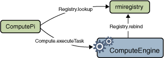

## Création d'un moteur de calcul

Ce projet se concentre sur une application distribuée simple, mais puissante, appelée moteur de calcul . Le moteur de calcul est un objet distant sur le serveur qui prend les tâches des clients, exécute les tâches et renvoie les résultats. Les tâches sont exécutées sur la machine sur laquelle le serveur s'exécute. Ce type d'application distribuée peut permettre à plusieurs machines clientes d'utiliser une machine particulièrement puissante ou disposant d'un matériel spécialisé.

L'aspect nouveau du moteur de calcul est que les tâches qu'il exécute n'ont pas besoin d'être définies lorsque le moteur de calcul est écrit ou démarré. De nouveaux types de tâches peuvent être créés à tout moment, puis confiés au moteur de calcul pour être exécutés. La seule exigence d'une tâche est que sa classe implémente une interface particulière. Le code nécessaire pour accomplir la tâche peut être téléchargé par le système RMI vers le moteur de calcul. Ensuite, le moteur de calcul exécute la tâche en utilisant les ressources de la machine sur laquelle le moteur de calcul s'exécute.

## Écriture d'un serveur RMI
Le serveur du moteur de calcul accepte les tâches des clients, exécute les tâches et renvoie les résultats. Le code serveur se compose d'une interface et d'une classe. L'interface définit les méthodes qui peuvent être invoquées depuis le client. Essentiellement, l'interface définit la vue du client sur l'objet distant. La classe fournit l'implémentation.
[En savoir plus]()

### Implémentation d'une interface distante
En général, une classe qui implémente une interface distante doit au moins effectuer les opérations suivantes :

* Déclarer les interfaces distantes en cours d'implémentation 
* Définir le constructeur pour chaque objet distant
* Fournir une implémentation pour chaque méthode distante dans les interfaces distantes

Un programme de serveur RMI doit créer les objets distants initiaux et les exporter vers l'environnement d'exécution RMI, ce qui les rend disponibles pour recevoir les appels distants entrants. Cette procédure d'établissement peut être soit encapsulée dans une méthode de la classe d'implémentation d'objet distant elle-même, soit incluse entièrement dans une autre classe. La procédure de configuration doit effectuer les opérations suivantes :

* Créer et installer un gestionnaire de sécurité 
* Créer et exporter un ou plusieurs objets distants
* Enregistrez au moins un objet distant auprès du registre RMI (ou auprès d'un autre service de nommage, tel qu'un service accessible via Java Naming and Directory Interface) à des fins d'amorçage

## [Création d'un programme client]()

## Compilation et exécution de l'exemple

### [Compilation des exemples de programmes](https://docs.oracle.com/javase/tutorial/rmi/compiling.html)

### [Running the Example Programs](https://docs.oracle.com/javase/tutorial/rmi/running.html)